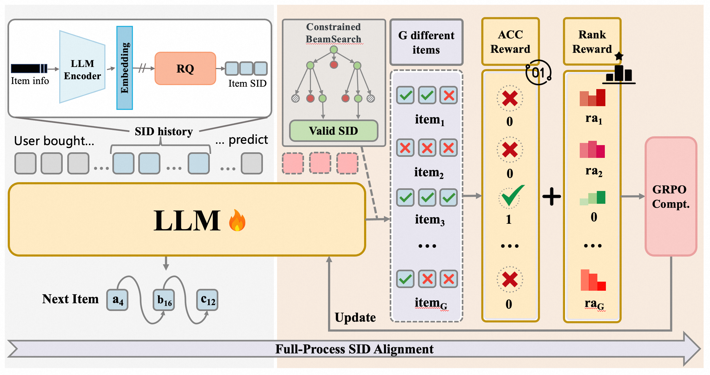

<div align="center">


</img> 

**An Open-Source Framework for
Scaling Generative Recommendation**


<a href="https://arxiv.org/abs/2510.24431">📄 Technical Report</a>
</div>

MiniOneRec is the first fully open-source **generative recommendation** framework, which provides an end-to-end workflow spanning **SID construction**, **supervised fine-tuning (SFT)**, and recommendation-oriented **reinforcement learning (RL)**. 

---

## Key Techniques 
<div align="center">
</img> 
</div>

- **SID Construction: MiniOneRec begins by transforming every product into a compact, semantically meaningful token.** It concatenates an item’s title and description, feeds this sentence through a frozen text encoder, and then quantises the resulting embedding with a three-level RQ-VAE. The outcome is a three-byte SID that both preserves hierarchical semantics and keeps the vocabulary extremely small.

- **SFT: With all items rewritten as SIDs, the model is first trained in a supervised fashion.** It views the chronologically ordered user history as a token sequence and learns, via next-token prediction, to generate the SID of the next product the user is likely to consume. Crucially, this stage is co-trained with a set of language-alignment objectives that map back and forth between natural language and SID space, allowing the recommender to inherit the world knowledge embedded in large language models while grounding that knowledge in discrete item codes.

- **Recommendation-Oriented RL: After SFT, MiniOneRec is further polished with a recommendation-oriented RL phase based on GRPO.** Multiple candidate recommendations are generated for each prompt, their rewards are normalised within the group to stabilise gradients, and a KL penalty keeps the updated policy close to its reference. Because the action space is a closed list of item SIDs, the system switches to constrained beam search, which guarantees that every beam is unique and valid, greatly improving sampling efficiency and diversity. The reward signal itself blends a binary correctness term with a rank-aware component that penalises high-probability yet incorrect items more heavily, and can be augmented with collaborative-filtering scores. Together, this pipeline enables MiniOneRec to couple dense linguistic knowledge, achieving a high-performance, lightweight generative recommendation system.

---

## Evaluation

<div align="center">
</img> 
</div>

---

## 🗂️ Repository Overview

| File / Directory          | Description                                                                                                   |
| ------------------------- | ------------------------------------------------------------------------------------------------------------- |
| `sft.sh`                  | Shell script to start the Supervised Fine-Tuning (SFT) stage                                           |
| `sft.py`                  | Python implementation of the SFT training loop                                                            |
| `rl.sh`                   | Shell script to start the Reinforcement Learning (RL) stage                             |
| `rl.py`                   | Python implementation of the RL training loop                                              |
| `minionerec_trainer.py`   | MiniOneRec trainer — GRPO-based trainer specialized for generative recommendation                              |
| `configs/`                | YAML configuration files                                            |
| `evaluate.sh`     | One-click offline Top-K evaluation script                                                        |
| `evaluate.py`     | Evaluation utilities for computing HR@K and NDCG@K.                                                           |
| `LogitProcessor.py`                | Logit processor for constrained decoding (Python implementation)                                         |
| `data.py`                | Data pipeline for SFT and RL training                          |
| `convert_dataset.py`                | Converts an RQ-trained dataset to the SFT-then-RL format                                            |
| `data/amazon18_data_process.sh`                |    Shell script to filter and preprocess Amazon data into an RQ-ready format                                      |
| `data/amazon18_data_process.py`                |   Python implementation of the Amazon data preprocessing pipeline                                        |
| `rq/amazon_text2emb.sh`                |   Shell script to generate item embeddings (title + description) via emb_model for the Amazon dataset                                   |
| `rq/amazon_text2emb.py`                |   Python implementation of the above embedding generation                                         |
| `rq/main.sh`                |   Shell script to train RQ-VAE on Amazon item embeddings                        |
| `rq/main.py`                |   Python implementation of RQ-VAE training                                            |
| `requirements.txt`        | List of Python dependencies                                                                                |

---

## 🚀 Quickstart

Use the pre-trained Industrial/Office SIDs we provide for a quick start!

### 1. Create an isolated Python environment

```bash
conda create -n MiniOneRec python=3.9 -y
conda activate MiniOneRec
```

### 2. Install required packages

```bash
pip install -r requirements.txt
```

### 3. SFT

```bash
bash sft.sh
```

### 4. Recommendation-Oriented Reinforcement Learning (RL)

```bash
bash rl.sh
```

### 5. Run the evaluation bash

```bash
bash evaluate.sh
```

---

## Institutions  <!-- omit in toc -->

This project is developed by the following institutions:

-  [LDS](https://data-science.ustc.edu.cn/_upload/tpl/15/04/5380/template5380/index.html)
-  [AlphaLab](https://alphalab-ustc.github.io/index.html)
-  [NExT](https://www.nextcenter.org/)
 
---


## Citation <!-- omit in toc -->

If you find our model/code/paper helpful, please consider citing our papers 📝 and staring us ⭐️！

```bib
@misc{MiniOneRec,
      title={MiniOneRec: An Open-Source Framework for Scaling Generative Recommendation}, 
      author={Xiaoyu Kong and Leheng Sheng and Junfei Tan and Yuxin Chen and Jiancan Wu and An Zhang and Xiang Wang and Xiangnan He},
      year={2025},
      eprint={2510.24431},
      archivePrefix={arXiv},
      primaryClass={cs.IR},
}

@article{ReRe,
      title={Reinforced Preference Optimization for Recommendation}, 
      author={Junfei Tan and Yuxin Chen and An Zhang and Junguang Jiang and Bin Liu and Ziru Xu and Han Zhu and Jian Xu and Bo Zheng and Xiang Wang},
      journal={arXiv preprint arXiv:2510.12211},
      year={2025},
}

@inproceedings{RecZero,
      title={Think before Recommendation: Autonomous Reasoning-enhanced Recommender}, 
      author={Xiaoyu Kong and Junguang Jiang and Bin Liu and Ziru Xu and Han Zhu and Jian Xu and Bo Zheng and Jiancan Wu and Xiang Wang},
      year={2025},
      booktitle={NeurIPS},
}

```
